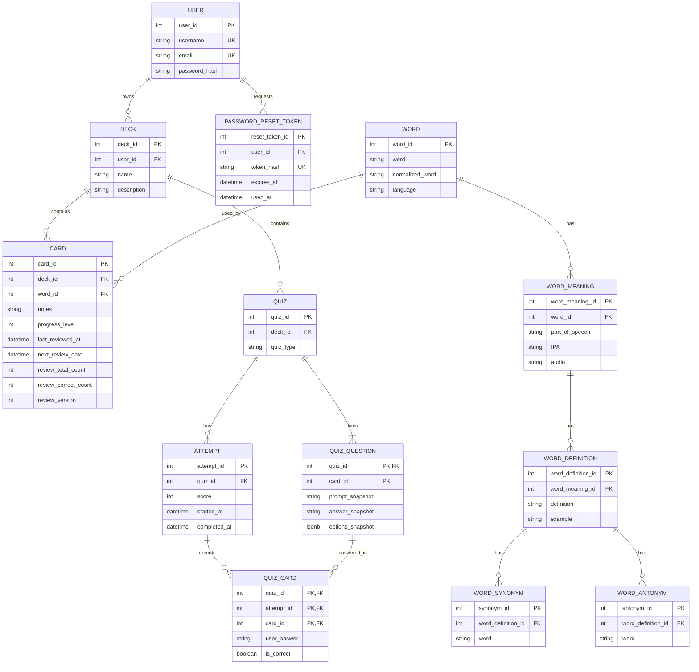

# Architecture Convention

Tài liệu này mô tả nghiệp vụ, trách nhiệm từng layer, database và API của backend. 

Lệnh cài đặt/chạy nằm ở [01_installation-setup.md](01_installation-setup.md). Nếu trong quá trình cài đặt mọi người thay đổi interface thì mọi người cũng phải cập nhật tài liệu trong cùng PR. Không được merge code thay đổi API mà docs vẫn chưa được cập nhật.

Stack: Python/FastAPI, SQLAlchemy, PostgreSQL 17, Alembic và Docker Compose. Phiên bản package nằm trong `requirements.txt`.

## 1. Requirements và nghiệp vụ

### 1.1. Authentication và quyền sở hữu

- Guest đăng ký bằng `username`, `email`, `password`; username/email unique, password chỉ lưu dạng hash ở trong database.
- User đăng nhập bằng username/password và nhận JWT.
- Deck, card, review, quiz và statistics API yêu cầu user có JWT token hợp lệ, nếu thiếu/sai thì token return `401 Unauthorized`.
- Đăng ký, đăng nhập và forget password là public.
- User chỉ được phép thao tác với deck của họ.
- Nếu 1 user truy cập resource của user khác hệ thống sẽ trả `403 Forbidden`.
- Khi chọn `Forget password`, hệ thống gửi link chứa reset token qua email.
- Token có thời hạn, dùng một lần; database chỉ lưu hash của token.
- Phản hồi yêu cầu reset không gây ra leak email.

### 1.2. Deck, card và dictionary

- User có các operation CRUD cho deck, xóa deck thì xóa card, quiz, câu hỏi và attempt của **riêng deck đó**.
- Card có word và notes tùy chọn; user chỉ được chuyển card sang deck khác của họ.
- Khi word chưa có trong database, backend gọi dictionary API. Nếu không tìm thấy, return `Word Not Found` và không tạo card.
- Nếu có, hệ thống lưu meaning, definition, example, IPA, audio, synonym, antonym sau khi fetch API.
- Một word có thể được dùng bởi nhiều card và được giữ lại dù card bị xóa.
- Một word có nhiều meaning, các definition trong cùng meaning dùng IPA/audio của meaning đó. Synonym và antonym gắn với definition.

### 1.3. Review theo Leitner

**Review** là luồng ôn do hệ thống đề xuất; **quiz** là bài tự kiểm tra. Quiz không làm đổi lịch review. `card.progress_level` được [áp dụng hệ thống Leiner](https://subjectguides.york.ac.uk/study-revision/leitner-system?audience=staff). 

Quy ước box: 5 box với khoảng chờ tương ứng **1, 3, 7, 14, 30 ngày**.

1. Card mới được đặt ở box 1; `last_reviewed_at` và `next_review_date` được khởi tạo là `NULL`.
2. Đề xuất tối đa 20 card đang hoạt động: card overdue for review trước, theo ngày đến hạn cũ nhất; đến card chưa được review. Response kèm `review_version` của mỗi card.
3. User xem đáp án rồi tự đánh dấu đúng/sai. Đúng tăng một box (tối đa box 5); sai về box 1. Cập nhật `last_reviewed_at = now` và `next_review_date = now + interval(box mới)`.
4. Không lưu lịch sử từng lần review. Card giữ `review_total_count`, `review_correct_count` và `review_version` (bắt đầu từ 0). Request gửi `expected_review_version`, backend cập nhật có điều kiện ngay tại database khi version còn khớp **và card còn đến hạn**, rồi tăng version cùng box, ngày review, bộ đếm trong một transaction.
5. Request cũ/gửi lặp không được tính lần hai.

### 1.4. Quiz và statistics

- Một deck có thể tạo nhiều quiz. Mỗi quiz có `quiz_type = multiple_choice` hoặc `fill_blank`.
- Khi tạo quiz, **backend tự chọn** tối đa 20 card hợp lệ từ deck.
- Nếu không tạo được ít nhất một câu hỏi hợp lệ cho `quiz_type` đã chọn, return error.
- Backend lưu bộ câu hỏi cố định.
- Không sửa bộ card, prompt, options và đáp án sau khi tạo. Mọi attempt sử dụng bộ câu hỏi ấy.
- Cả fill và multiple choice chỉ dùng card có example chứa từ đích. Chọn example ngẫu nhiên **một** lần khi tạo quiz, thay target word bằng blank, user tự điền từ, không case sensitive.
- Multiple choice dùng cùng câu có blank, với 4 options: từ đúng và 3 từ ngẫu nhiên khác từ bảng `word`.
- Không dùng chính từ đúng, từ trùng hoặc synonym của từ đúng.
- Nếu không đủ 3 từ nhiễu, card đó không hợp lệ cho quiz multiple choice.
- Trộn options một lần khi tạo quiz rồi lưu cùng đáp án chuẩn, không trộn lại theo attempt.
- Khi bắt đầu làm, tạo attempt với `started_at` và `score`/`completed_at` bằng `NULL`.
- Khi nộp đủ đáp án, ghi kết quả từng card, score là số câu đúng và `completed_at` trong một transaction. Attempt bỏ dở vẫn có thể mở lại, nếu bắt đầu lần mới thì attempt cũ vẫn chưa hoàn thành.
- Làm sai hoặc làm lại quiz không ảnh hưởng Leitner.
- Statistics chỉ tính completed attempt. Tiến độ deck = số card đang hoạt động ở box ≥ 2 / tổng card đang hoạt động, deck rỗng có tiến độ = 0.
- Review accuracy = tổng lượt review đúng / tổng lượt review, khi chưa có review, accuracy là `null`.

## 2. Project structure

| Vị trí | Trách nhiệm | Lý do tách |
| --- | --- | --- |
| `backend/app/main.py` | Tạo FastAPI app, gắn router | Giữ điểm khởi động ngắn |
| `backend/app/routers/` | HTTP path, nhận request, gọi service, trả response | HTTP không chứa nghiệp vụ/SQL |
| `backend/app/schemas/` | Pydantic schema cho request/response và snapshot | Không lộ ORM model qua API |
| `backend/app/services/` | Ownership, dictionary, Leitner, tạo/chấm quiz và transaction | Một nơi áp dụng quy tắc nghiệp vụ |
| `backend/app/repositories/` | Truy vấn/ghi dữ liệu qua SQLAlchemy | Query không rải trong router/service |
| `backend/app/models/` | ORM model và quan hệ database | Phân biệt schema DB với HTTP |
| `backend/app/db/` | Engine, session, metadata; schema thay đổi qua Alembic | Quản lý kết nối nhất quán |
| `backend/app/core/` | Config, JWT và password hashing | Không lặp mã bảo mật |

## 3. Database design

### 3.1. ERD

Sơ đồ dùng [Mermaid ER diagram](https://mermaid.js.org/syntax/entityRelationshipDiagram).

### 3.2. Khóa, quan hệ và xóa

- `quiz_question` có khóa chính `(quiz_id, card_id)`. Lúc tạo quiz, service chỉ chọn card đang thuộc deck của quiz, tạo quiz và toàn bộ câu hỏi trong một transaction.
- `attempt` thuộc một quiz, có khóa `attempt_id` và `UNIQUE(attempt_id, quiz_id)` composite FK.
- `attempt.completed_at IS NULL` nghĩa là chưa nộp, tương ứng `score IS NULL` và chưa có `quiz_card`.
- Sau Khi hoàn thành, `score` có giá trị. Một attempt bỏ dở không bị tính vào statistics và có thể tiếp tục. Backend không lưu đáp án từng phần trước khi submit; nếu cần giữ phần đã nhập, frontend lưu cục bộ.
- `quiz_card` có khóa chính `(quiz_id, attempt_id, card_id)`. FK ghép `(attempt_id, quiz_id) → attempt(attempt_id, quiz_id)` bảo đảm attempt thuộc quiz, FK ghép `(quiz_id, card_id) → quiz_question(quiz_id, card_id)` bảo đảm card nằm trong bộ câu hỏi. Ba FK riêng hoặc chỉ khóa chính ba cột đều không đủ. [PostgreSQL hỗ trợ khóa và FK ghép](https://www.postgresql.org/docs/17/ddl-constraints.html).
- Xóa quiz xóa câu hỏi, attempt và kết quả, xóa deck xóa quiz và card của deck.

### 3.3. Snapshot

Snapshot được tạo một lần cùng quiz. `quiz_question` lưu câu example đã thay target word bằng blank, đáp án chuẩn và options theo thứ tự cố định. Với multiple choice, `options_snapshot` là JSONB array gồm 4 option ID/text đã trộn, ví dụ `[{"id":"A","text":"apple"},{"id":"B","text":"orange"},...]`. `answer_snapshot` là ID option đúng. Với fill, `options_snapshot = NULL` và `answer_snapshot` là từ cần điền. Schema Pydantic kiểm khi create / read.

Mỗi attempt đọc **snapshot** để hiển thị/chấm; `quiz_card` chỉ lưu đáp án user và đúng/sai. `quiz_question.card_id` là ID gốc, không có FK trực tiếp tới `card`: khi card còn tồn tại vẫn tra được, khi card bị xóa quiz vẫn hoạt động nhờ snapshot. Nếu muốn thay bộ câu hỏi, tạo quiz mới.

## 4. API list

| Nhóm | Method | Path | Mục đích |
| --- | --- | --- | --- |
| Auth | POST | `/api/auth/register` | Đăng ký |
| Auth | POST | `/api/auth/login` | Nhận JWT |
| Auth | POST | `/api/auth/forgot-password` | Yêu cầu gửi reset link qua email |
| Auth | POST | `/api/auth/reset-password` | Đặt mật khẩu mới bằng reset token |
| Deck | POST | `/api/decks` | Tạo deck |
| Deck | GET | `/api/decks` | Danh sách deck |
| Deck | GET | `/api/decks/{deck_id}` | Chi tiết deck |
| Deck | PATCH | `/api/decks/{deck_id}` | Sửa deck |
| Deck | DELETE | `/api/decks/{deck_id}` | Xóa deck, card, quiz và attempt của deck |
| Deck | GET | `/api/decks/{deck_id}/cards` | Card trong deck |
| Card | POST | `/api/decks/{deck_id}/cards` | Tạo card |
| Card | PATCH | `/api/cards/{card_id}` | Sửa notes hoặc chuyển deck |
| Card | DELETE | `/api/cards/{card_id}` | Xóa card, quiz cũ giữ snapshot |
| Review | GET | `/api/reviews/due` | Tối đa 20 card đến hạn/chưa review, kèm `review_version` |
| Review | POST | `/api/reviews/{card_id}` | Body: `is_correct`, `expected_review_version`, cập nhật Leitner một lần |
| Quiz | POST | `/api/decks/{deck_id}/quizzes` | Backend tự chọn card và tạo bộ câu hỏi cố định; body có `quiz_type`, không có `card_ids` |
| Quiz | GET | `/api/quizzes` | Danh sách quiz của user; lọc theo `quiz_type` |
| Quiz | GET | `/api/quizzes/{quiz_id}` | Chi tiết quiz/câu hỏi, chưa lộ đáp án |
| Quiz | GET | `/api/quizzes/{quiz_id}/attempts` | Danh sách attempt của quiz và trạng thái hoàn thành |
| Quiz | POST | `/api/quizzes/{quiz_id}/attempts` | Tạo attempt chưa hoàn thành, trả `attempt_id` và câu hỏi |
| Quiz | POST | `/api/quizzes/{quiz_id}/attempts/{attempt_id}/submit` | Nộp toàn bộ đáp án, ghi kết quả, score và `completed_at` cùng transaction |
| Quiz | GET | `/api/quizzes/{quiz_id}/attempts/{attempt_id}` | Chưa nộp: câu hỏi để tiếp tục, không lộ đáp án, nếu đã nộp: score, câu sai và đáp án |
| Statistics | GET | `/api/decks/{deck_id}/statistics` | Tiến độ và review accuracy của deck |
| Statistics | GET | `/api/quizzes/{quiz_id}/statistics` | Kết quả các attempt của quiz |
| Statistics | GET | `/api/statistics` | Tổng quan của user |

Frontend kiểm tra số câu và lựa chọn trước khi gửi để hỗ trợ user; backend kiểm tra attempt thuộc quiz, `card_id` khớp đúng bộ câu hỏi, và đáp án multiple choice thuộc options của câu đó. Request sai không được ghi kết quả một phần. Submit khóa/kiểm tra attempt trong transaction và chỉ chấp nhận khi `completed_at IS NULL`; request sau khi hoàn thành trả `409 Conflict` và không ghi lại score. Review với version cũ hoặc card chưa đến hạn cũng trả `409 Conflict`, không tăng box hay bộ đếm. Các path xem card sai và `/complete` trong đề xuất ban đầu được gộp vào GET attempt vì câu sai phụ thuộc vào **attempt**, không chỉ quiz.
